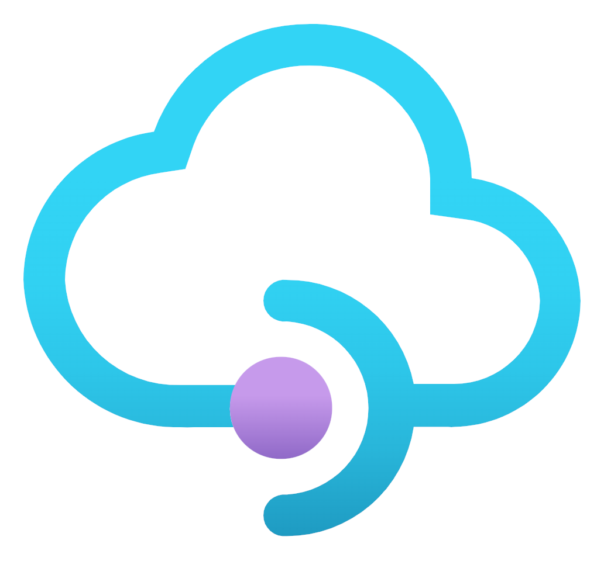
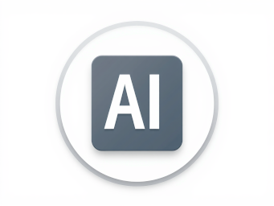

## Hi there 👋

My name is Chris. I'm a DevOps/Cloud/Infra/SRE Engineer.

I use:
- **Terraform** (all clouds)
- **Bash**
- **Python**
- **Kubernetes**
- and a little Ansible, Golang, PowerShell.

## ⬇️ Visit my main repos now for examples of the above ⬇️

⚠️ I am a heavy user of AI/LLMs. With AGI/ASI barely 3 years away, there's no good reason not to use it anymore. ⚠️

| [**Cloud DevOps Scripts**](https://github.com/chrisbuckleycode/cloud-devops-scripts)                  | [**Useful Scripts**](https://github.com/chrisbuckleycode/usefulscripts)                  | [**AI**](https://github.com/chrisbuckleycode/ai)                  
| ----------------------- | ----------------------- | ----------------------- |
|  |  |  |
